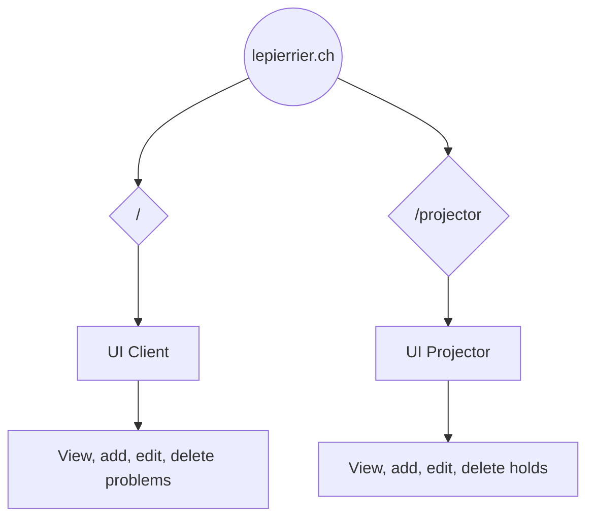

# Concept

## Client routes

```mermaid
    graph TD;
        A((lepierrier.ch));
            A-->B{/};
                B-->B1[UI Client];
                B1-->B2[View, add, edit, delete problems];
            A-->C{/projector};
                C-->C1[UI Projector];
                C1-->C2[View, add, edit, delete holds];
```
